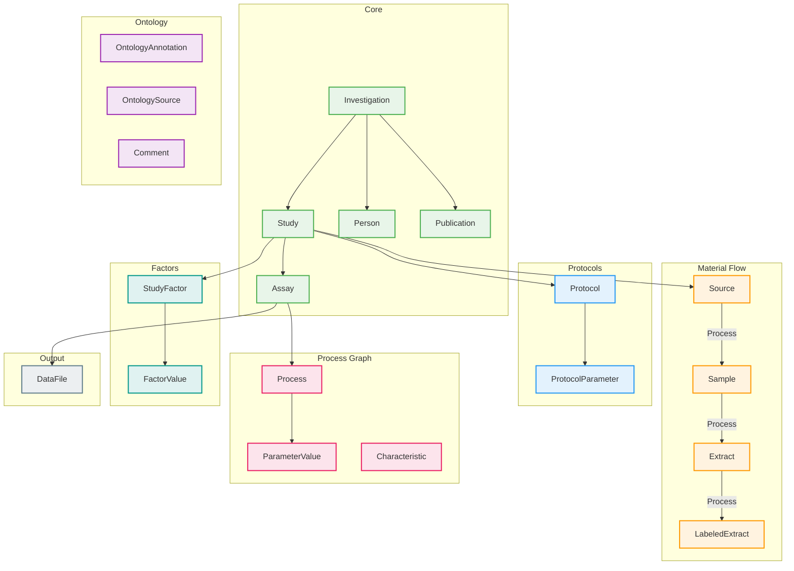
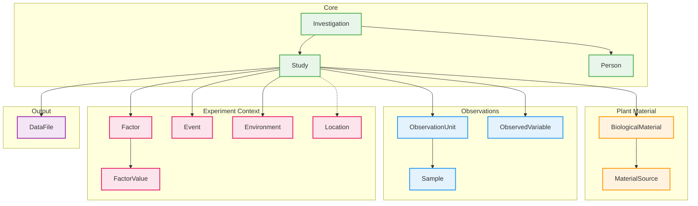
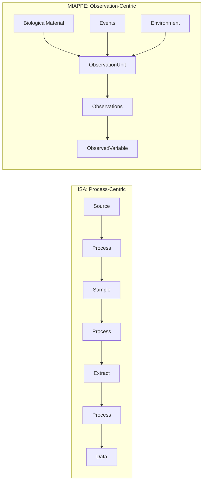
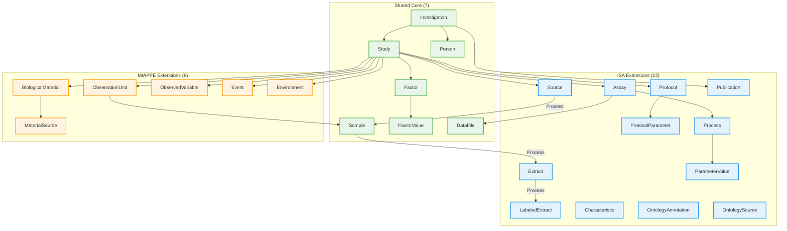
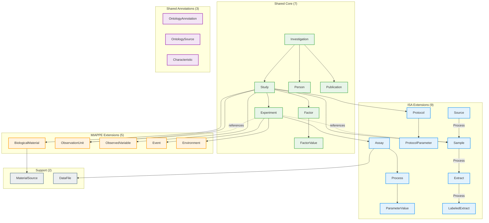
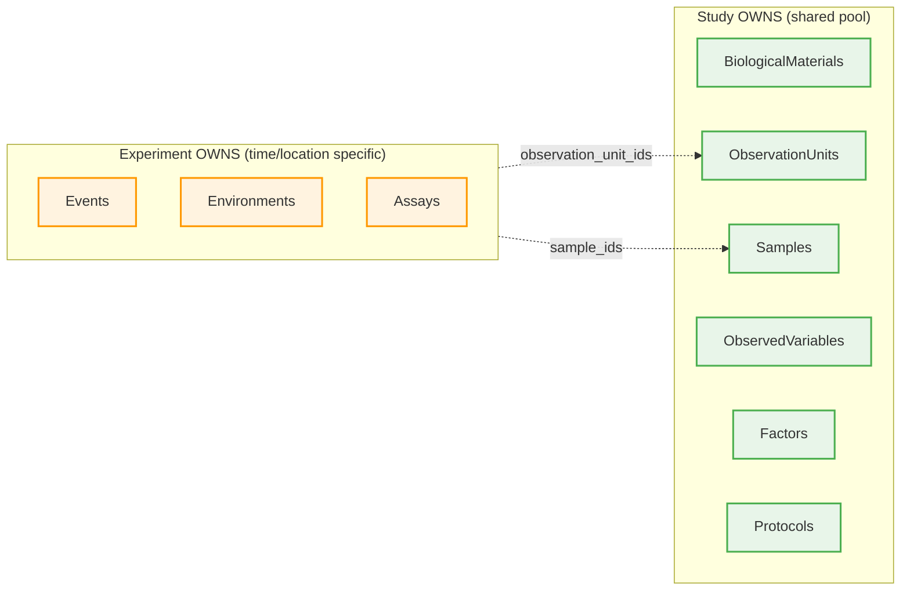

# Data Model Diagrams

Visual reference for profile data models.

## ISA v1.0

20 entities for life science experiments with process-centric workflows.

---

## MIAPPE v1.1

14 entities for plant phenotyping experiments.

---

## Profile Comparison

| Profile | Entities | Focus |
|---------|----------|-------|
| ISA v1.0 | 20 | Multi-omics, process workflows |
| MIAPPE v1.1 | 14 | Plant phenotyping, field trials |
| Combined v1.0 | 25 | Unified ISA + MIAPPE |
| Combined v2.0 | 26 | + Experiment entity, reference model |

### ISA vs MIAPPE Workflow Models

---

## ISA-MIAPPE-Combined v1.0

25 entities combining ISA and MIAPPE.

---

## ISA-MIAPPE-Combined v2.0

26 entities with new Experiment entity and reference-based ownership.

### v2.0 Ownership Model

