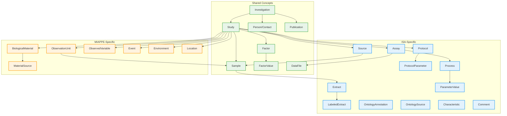
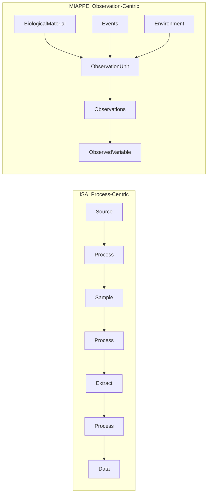

# ISA and MIAPPE Comparison

This document compares the ISA (Investigation-Study-Assay) and MIAPPE (Minimum Information About Plant Phenotyping Experiments) metadata standards, highlighting their shared concepts and domain-specific extensions.

## Overview

Both standards follow a hierarchical structure for organizing experimental metadata:

- **ISA**: General-purpose framework for life science experiments, with emphasis on assay workflows and data provenance
- **MIAPPE**: Plant phenotyping-specific standard, with emphasis on field trials, germplasm, and environmental conditions

## Entity Comparison Diagram

## Detailed Comparison

### Shared Core Entities

| Concept | ISA | MIAPPE | Notes |
|---------|-----|--------|-------|
| **Investigation** | `Investigation` | `Investigation` | Top-level container for studies |
| **Study** | `Study` | `Study` | Central experimental unit |
| **Person** | `Person` (last_name, first_name) | `Person` (name) | Contact information; ISA splits name fields |
| **Publication** | `Publication` | via `associated_publications` | ISA has structured entity; MIAPPE uses DOI list |
| **Sample** | `Sample` | `Sample` | Material sampled from subjects |
| **Factor** | `StudyFactor` | `Factor` | Independent variables |
| **FactorValue** | `FactorValue` | `FactorValue` | Specific factor levels |
| **DataFile** | `DataFile` | `DataFile` | Output data files |

### ISA-Specific Entities

| Entity | Purpose |
|--------|---------|
| **Assay** | Measurement/test performed on samples; links technology to data |
| **Protocol** | Detailed experimental procedures with parameters |
| **Source** | Original biological material before processing |
| **Extract** | Material extracted from samples |
| **LabeledExtract** | Labeled material for detection |
| **Process** | Nodes in experimental workflow graph |
| **OntologyAnnotation** | Structured ontology term references |
| **Characteristic** | Material property qualifiers |

### MIAPPE-Specific Entities

| Entity | Purpose |
|--------|---------|
| **BiologicalMaterial** | Germplasm/plant material with accession info |
| **ObservationUnit** | Plot, plant, or pot being measured |
| **ObservedVariable** | Trait + Method + Scale (measurement definition) |
| **Event** | Discrete occurrences (sowing, harvest, treatment) |
| **Environment** | Environmental parameter recordings |
| **Location** | Geographic site information |
| **MaterialSource** | Genebank or institution providing material |

## Structural Differences

### ISA Approach
- Models experiments as **directed acyclic graphs** of processes
- Tracks material transformations (Source -> Sample -> Extract -> Data)
- Protocol-centric: every transformation references a protocol
- Supports complex multi-omics workflows

### MIAPPE Approach
- Models experiments as **observation units** with measurements
- Field trial-oriented: plots, blocks, replicates
- Trait-centric: measurements defined by trait/method/scale
- Includes environmental and event tracking

## Mapping Between Standards

When converting between ISA and MIAPPE:

| ISA Concept | MIAPPE Equivalent | Mapping Notes |
|-------------|-------------------|---------------|
| Source | BiologicalMaterial | ISA Source ~ MIAPPE germplasm |
| Sample | Sample or ObservationUnit | Depends on context |
| Assay | Study + ObservedVariable | MIAPPE doesn't separate assays |
| Protocol | Event or cultural_practices | Less structured in MIAPPE |
| Characteristic | BiologicalMaterial fields | Organism, genus, species, etc. |
| Process | Event | MIAPPE events are simpler |

## When to Use Each Standard

**Use ISA when:**

- Working with multi-omics data (genomics, proteomics, metabolomics)
- Need detailed protocol documentation
- Tracking complex sample processing workflows
- Integrating with ISA-Tab ecosystem tools

**Use MIAPPE when:**

- Conducting plant phenotyping experiments
- Managing field trial data
- Need germplasm/accession tracking
- Working with BrAPI-compatible systems
- Environmental data is important

## References

- [ISA Framework](https://isa-tools.org/)
- [ISA-Tab Specification](https://isa-specs.readthedocs.io/)
- [MIAPPE Standard](https://www.miappe.org/)
- [MIAPPE v1.1 Checklist](https://github.com/MIAPPE/MIAPPE/tree/master/MIAPPE_Checklist-Data-Model-v1.1)
