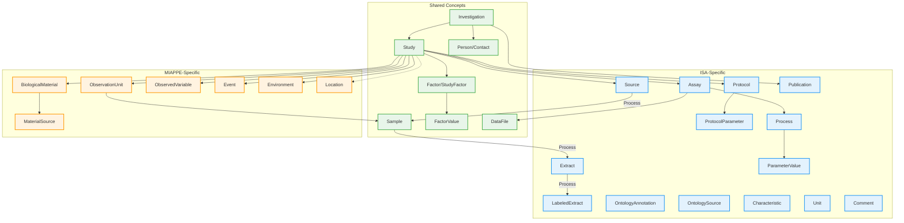
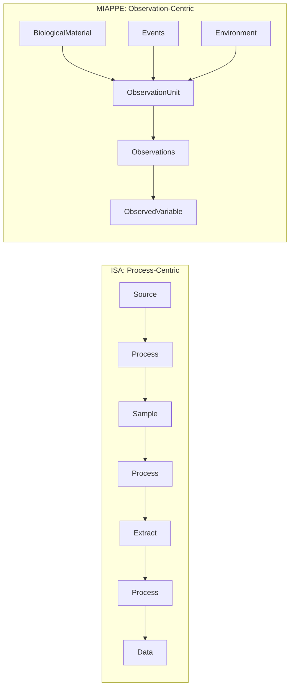

# ISA and MIAPPE Comparison

This document compares the ISA (Investigation-Study-Assay) and MIAPPE (Minimum Information About Plant Phenotyping Experiments) metadata standards, highlighting their shared concepts and domain-specific extensions.

## Overview

Both standards follow a hierarchical structure for organizing experimental metadata:

- **ISA**: General-purpose framework for life science experiments, with emphasis on assay workflows and data provenance
- **MIAPPE**: Plant phenotyping-specific standard, with emphasis on field trials, germplasm, and environmental conditions

## Entity Comparison Diagram



## Detailed Comparison

### Shared Core Entities

| Concept | ISA | MIAPPE | Notes |
|---------|-----|--------|-------|
| **Investigation** | `Investigation` | `Investigation` | Entry point; contains overall experimental context |
| **Study** | `Study` | `Study` | Central unit; defines experimental design |
| **Person** | `Person` (last_name, first_name) | `Person` (name) | Contact information; ISA splits name fields |
| **Sample** | `Sample` | `Sample` | Material collected from observation units/subjects |
| **Factor** | `StudyFactor` | `Factor` | Independent variables manipulated in experiment |
| **FactorValue** | `FactorValue` | `FactorValue` | Specific factor levels/treatments |
| **DataFile** | `DataFile` | `DataFile` | Output data files (tabular, images, etc.) |

!!! note "Publication Handling"
    ISA has a structured `Publication` entity with PubMed ID, DOI, author list, and status.
    MIAPPE uses a simple list of DOIs/URLs in `associated_publications`.

### ISA-Specific Entities

| Entity | Purpose |
|--------|---------|
| **Assay** | Test performed on samples producing qualitative/quantitative measurements |
| **Protocol** | Experimental procedures with parameters and components |
| **Source** | Original biological material before any processing |
| **Extract** | Material extracted from samples (e.g., DNA, RNA, protein) |
| **LabeledExtract** | Labeled material for detection (e.g., fluorescent tags) |
| **Process** | Nodes in experimental workflow graph; links materials to protocols |
| **OntologyAnnotation** | Structured ontology term references with accession numbers |
| **OntologySource** | Provenance of ontology terms used in annotations |
| **Characteristic** | Material property qualifiers (organism, strain, etc.) |
| **ParameterValue** | Values for protocol parameters in process instances |
| **Unit** | Dimensional data classification (e.g., mg, mL, hours) |
| **Publication** | Structured publication metadata (PubMed ID, DOI, authors) |
| **Comment** | Free-text key-value annotations |

### MIAPPE-Specific Entities

| Entity | Purpose |
|--------|---------|
| **BiologicalMaterial** | Germplasm/plant material with accession info |
| **ObservationUnit** | Plot, plant, or pot being measured |
| **ObservedVariable** | Trait + Method + Scale (measurement definition) |
| **Event** | Discrete occurrences (sowing, harvest, treatment) |
| **Environment** | Environmental parameter recordings |
| **Location** | Geographic site information |
| **MaterialSource** | Genebank or institution providing material |

## Structural Differences



### ISA Approach
- Models experiments as **directed acyclic graphs** of processes
- Tracks material transformations (Source -> Sample -> Extract -> Data)
- Protocol-centric: every transformation references a protocol
- Supports complex multi-omics workflows

### MIAPPE Approach
- Models experiments as **observation units** with measurements
- Field trial-oriented: plots, blocks, replicates
- Trait-centric: measurements defined by trait/method/scale
- Includes environmental and event tracking

## Mapping Between Standards

When converting between ISA and MIAPPE:

| ISA Concept | MIAPPE Equivalent | Mapping Notes |
|-------------|-------------------|---------------|
| Source | BiologicalMaterial | ISA Source ~ MIAPPE germplasm |
| Sample | Sample or ObservationUnit | Depends on context |
| Assay | Study + ObservedVariable | MIAPPE doesn't separate assays |
| Protocol | Event or cultural_practices | Less structured in MIAPPE |
| Characteristic | BiologicalMaterial fields | Organism, genus, species, etc. |
| Process | Event | MIAPPE events are simpler |

## When to Use Each Standard

**Use ISA when:**

- Working with multi-omics data (genomics, proteomics, metabolomics)
- Need detailed protocol documentation
- Tracking complex sample processing workflows
- Integrating with ISA-Tab ecosystem tools

**Use MIAPPE when:**

- Conducting plant phenotyping experiments
- Managing field trial data
- Need germplasm/accession tracking
- Working with BrAPI-compatible systems
- Environmental data is important

**Use Combined when:**

- Need both multi-omics and phenotyping capabilities
- Conducting integrated plant research (phenomics + genomics/transcriptomics)
- Want a single unified schema for diverse experimental data

## Combined Profile (ISA-MIAPPE-Combined)

The `isa-miappe-combined` profile merges ISA and MIAPPE entities into a unified model. It uses ISA-style `identifier` fields as the common naming convention.

### Available Versions

| Version | Status | Key Features |
|---------|--------|--------------|
| **v1.0** | Stable | Initial unified model with all ISA and MIAPPE entities |
| **v2.0** | Current | Streamlined model with new Experiment entity and reference-based ownership |

### Version 2.0 Changes

Version 2.0 introduces significant improvements:

- **Person**: Unified name handling (`given_name`/`family_name`, `full_name` computed)
- **Publication**: Promoted to shared core (was ISA-only in v1.0)
- **New Experiment entity**: For multi-trial studies within a Study
- **Reference model**: Study owns entities, Experiment references them by ID
- **Removed**: `associated_publications` URL list (use Publication entities instead)

**Ownership Model (v2.0):**

- **Study owns**: BiologicalMaterials, ObservationUnits, Samples, ObservedVariables, Factors, Protocols
- **Experiment owns**: Events, Environments, Assays (time/location specific)
- **Experiment references**: `observation_unit_ids`, `sample_ids` (from Study's pool)

**Entity Categories (v2.0):**

| Category | Count | Entities |
|----------|-------|----------|
| Shared Core | 7 | Investigation, Study, Experiment, Person, Publication, Factor, FactorValue |
| ISA Extensions | 9 | Assay, Protocol, ProtocolParameter, Process, ParameterValue, Source, Sample, Extract, LabeledExtract |
| MIAPPE Extensions | 5 | BiologicalMaterial, ObservationUnit, ObservedVariable, Event, Environment |
| Shared Annotations | 3 | OntologyAnnotation, OntologySource, Characteristic |
| MIAPPE Support | 1 | MaterialSource |

### Combined Profile Usage

```python
from metaseed.facade import ProfileFacade

# Load combined profile (v2.0 recommended)
combined = ProfileFacade("isa-miappe-combined", "2.0")

# Create ISA entities
protocol = combined.Protocol(name="RNA Extraction", protocol_type="extraction")
assay = combined.Assay(filename="assay.txt", measurement_type="transcription profiling")

# Create MIAPPE entities
material = combined.BiologicalMaterial(identifier="BM-001", organism="Zea mays")
obs_unit = combined.ObservationUnit(identifier="OU-001", observation_unit_type="plant")

# Create shared entities
investigation = combined.Investigation(identifier="INV-001", title="Integrated Study")

# v2.0: Create Experiment for multi-trial studies
experiment = combined.Experiment(
    identifier="EXP-001",
    title="Field Trial 2024",
    observation_unit_ids=["OU-001", "OU-002"]  # Reference Study's observation units
)
```

```python
# Load v1.0 if needed for compatibility
combined_v1 = ProfileFacade("isa-miappe-combined", "1.0")
```

## MIAPPE as an ISA Profile

MIAPPE was explicitly designed as an **ISA Configuration Profile**, not a separate standard. This has important implications for integration.

### What "ISA Profile" Means Technically

An ISA profile is implemented through:

| Component | Description |
|-----------|-------------|
| XML Configuration Files | Define required/optional fields using [ISAconfigurator](https://github.com/ISA-tools/ISAconfigurator) |
| Domain-Specific Extensions | Additional columns in Study and Assay files |
| Validation Rules | Custom validators for MIAPPE requirements |
| Official Repository | [MIAPPE/ISA-Tab-for-plant-phenotyping](https://github.com/MIAPPE/ISA-Tab-for-plant-phenotyping) |

### Official MIAPPE-to-ISA Mapping

From the [MIAPPE 1.1 paper](https://pmc.ncbi.nlm.nih.gov/articles/PMC7317793/):

> "The MIAPPE data model is reconciled with the more generic data models underlying the ISA-Tab exchange format through key objects such as Investigation and Study."

| MIAPPE Entity | ISA Mapping | Implementation Notes |
|---------------|-------------|----------------------|
| Investigation | Investigation | Direct mapping |
| Study | Study | Direct mapping |
| Person | Person | MIAPPE `name` vs ISA `first_name`/`last_name` |
| Biological Material | **Source** | Germplasm stored as ISA Source |
| Observation Unit | **Sample** | Plots/plants as ISA Samples |
| Sample (sub-plant) | **Extract** | Leaf tissue etc. as Extracts |
| Observed Variable | Trait Definition File | External file reference |
| Environment | Growth Protocol | Parameters in protocol definition |
| Event | Event-type Protocol | Discrete occurrences as protocol type |
| Factor | Study Factor | Direct correspondence |
| Data File | Data File | Direct correspondence |

!!! note "Publication Conflict"
    MIAPPE only supports Investigation-level publications, while ISA-Tab allows both Investigation and Study-level entries.

### Existing Integration Tools

| Tool | Language | Purpose | MIAPPE Support |
|------|----------|---------|----------------|
| [isa-api](https://github.com/ISA-tools/isa-api) | Python | ISA model manipulation | Via MIAPPE config files |
| [isa4j](https://ipk-bit.github.io/isa4j/) | Java | High-performance ISA-Tab | Built-in MIAPPE validation |
| [plant-brapi-to-isa](https://github.com/elixir-europe/plant-brapi-to-isa) | Python | BrAPI to ISA-Tab | MIAPPE-compliant output |
| [FAIRDOM-SEEK](https://fair-dom.org/) | Ruby | Data management | Extended metadata for MIAPPE |
| [MIAPPE Wizard](https://www.denbi.de/) | Web | Visual metadata creation | Native MIAPPE + ISA export |

### Documented Challenges

#### Scale Issues

From the [FAIR Data presentation](https://moodle.france-bioinformatique.fr/):

> "The ISA structure is not well-suited for large-scale plant phenotyping experiments with thousands of measurements per experiment."

The isa4j library addresses this, achieving 1 million row writes in 43 seconds compared to 8.6 hours with Python isatools.

#### Structural Mismatches

| Challenge | Description |
|-----------|-------------|
| Process vs Event | ISA uses DAG of processes; MIAPPE uses flat event list |
| Observation Hierarchy | ISA Sample graph vs MIAPPE Block/Plot/Plant hierarchy |
| Protocol Parameters | Declared in Investigation, values in Study rows |
| BrAPI Gaps | v1.3 missing fields; v2.0 better aligned |

### Integration Feasibility Assessment

| Aspect | Feasibility | Notes |
|--------|-------------|-------|
| Data model unification | High | Both share Investigation-Study hierarchy |
| Validation | High | ISA config files + PPEO ontology |
| Serialization | Medium | ISA-Tab at scale requires isa4j; prefer JSON |
| BrAPI integration | High | BrAPI v2 is MIAPPE 1.1 compatible |
| Multi-omics + Phenotyping | High | ISA Assay + MIAPPE observations coexist |

### Integration Approaches

Several approaches exist for combining ISA and MIAPPE:

| Approach | Used By | Description | Pros | Cons |
|----------|---------|-------------|------|------|
| **ISA Configuration** | Official MIAPPE | XML config files define MIAPPE fields within ISA-Tab | Standard tooling, validated | ISA-Tab file limitations at scale |
| **Extended Metadata** | FAIRDOM-SEEK | Key-value extensions on ISA entities | Flexible, minimal changes | Loose typing, no schema enforcement |
| **Merged Schema** | This project (`isa-miappe-combined`) | Single typed schema with both entity sets | Strong typing, single model | Custom implementation, no existing ecosystem |
| **BrAPI Bridge** | Phenotyping databases | API layer translates between formats | API-first, widely adopted | Conversion overhead, potential data loss |
| **Dual Export** | Some platforms | Maintain both formats separately | Full compliance with each | Duplication, sync issues |

Each approach has trade-offs. The choice depends on:

- **Scale**: ISA-Tab struggles with large phenotyping datasets
- **Tooling**: ISA config approach has existing validator support
- **Flexibility**: Extended metadata allows ad-hoc fields
- **Type Safety**: Merged schema enforces field types
- **Interoperability**: BrAPI bridge connects to existing systems

### The PPEO Ontology

The [Plant Phenotyping Experiment Ontology (PPEO)](https://github.com/MIAPPE/MIAPPE-ontology) provides:

- OWL classes for MIAPPE sections
- Data properties with value types and cardinality
- Object properties for entity relations
- Cross-resource labels for ISA-Tab and BrAPI mapping

Available at: [AgroPortal PPEO](https://agroportal.lirmm.fr/ontologies/PPEO)

## References

- [ISA Tools - Official Site](https://isa-tools.org/)
- [ISA Abstract Model Specification](https://isa-specs.readthedocs.io/en/latest/isamodel.html)
- [ISA-Tab Format Specification](https://isa-specs.readthedocs.io/en/latest/isatab.html)
- [ISA Configurations](https://isa-tools.org/format/configurations/index.html)
- [MIAPPE Official Site](https://www.miappe.org/)
- [MIAPPE GitHub Repository](https://github.com/MIAPPE/MIAPPE)
- [MIAPPE 1.1 Paper (Papoutsoglou et al., 2020)](https://pmc.ncbi.nlm.nih.gov/articles/PMC7317793/)
- [ISA-Tab for Plant Phenotyping (MIAPPE-ISA config)](https://github.com/MIAPPE/ISA-Tab-for-plant-phenotyping)
- [PPEO Ontology on AgroPortal](https://agroportal.lirmm.fr/ontologies/PPEO)
- [PPEO GitHub Repository](https://github.com/MIAPPE/MIAPPE-ontology)
- [isa4j Java Library](https://ipk-bit.github.io/isa4j/)
- [plant-brapi-to-isa Converter](https://github.com/elixir-europe/plant-brapi-to-isa)
- [FAIRDOM-SEEK MIAPPE Project](https://fair-dom.org/fairdom-in-use/plant-is-and-miappe)
