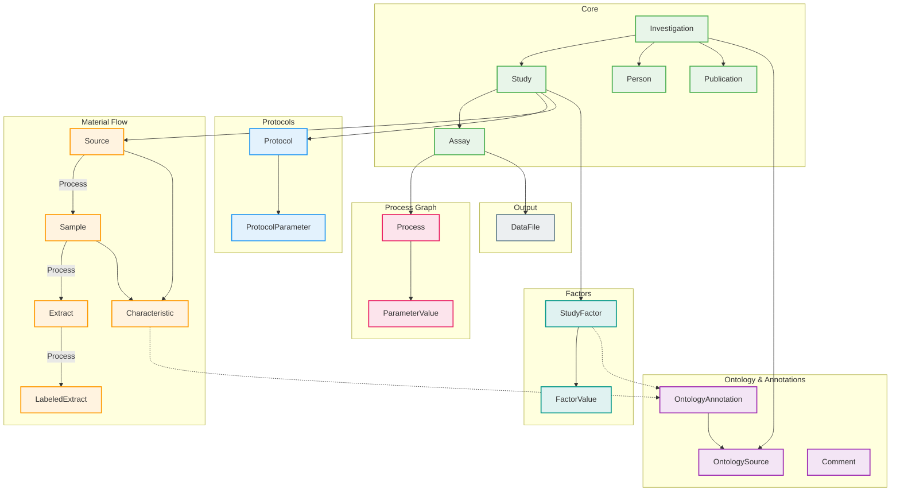

# ISA v1.0

20 entities for life science experiments with process-centric workflows.



## Entities

| Category | Entities |
|----------|----------|
| **Core** | Investigation, Study, Assay, Person, Publication |
| **Protocols** | Protocol, ProtocolParameter |
| **Material Flow** | Source, Sample, Extract, LabeledExtract, Characteristic |
| **Process Graph** | Process, ParameterValue |
| **Factors** | StudyFactor, FactorValue |
| **Ontology** | OntologyAnnotation, OntologySource, Comment |
| **Output** | DataFile |

## Key Concepts

- **Process-centric**: Experiments modeled as directed acyclic graphs of processes
- **Material transformations**: Source → Sample → Extract → LabeledExtract → Data
- **Protocol-driven**: Every transformation references a protocol
- **Ontology-backed**: Terms annotated with OntologyAnnotation

## Usage

```python
from metaseed import isa

i = isa()
source = i.Source(unique_id="SRC001", name="Patient 1")
sample = i.Sample(unique_id="SAM001", name="Blood sample", derives_from=[source])
```
