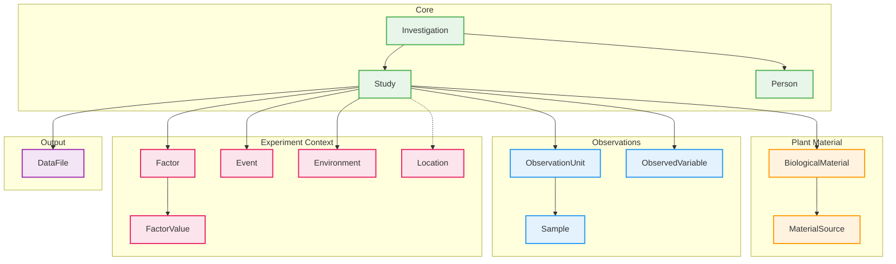

# MIAPPE v1.1

14 entities for plant phenotyping experiments.



## Entities

| Category | Entities |
|----------|----------|
| **Core** | Investigation, Study, Person |
| **Plant Material** | BiologicalMaterial, MaterialSource |
| **Observations** | ObservationUnit, ObservedVariable, Sample |
| **Experiment Context** | Factor, FactorValue, Event, Environment, Location |
| **Output** | DataFile |

## Key Concepts

- **Observation-centric**: Experiments modeled as observation units with measurements
- **Field trial-oriented**: Plots, blocks, replicates
- **Trait-centric**: Measurements defined by trait/method/scale (ObservedVariable)
- **Environmental tracking**: Events and Environment entities

## Usage

```python
from metaseed import miappe

m = miappe()
inv = m.Investigation(unique_id="INV001", title="Drought study")
material = m.BiologicalMaterial(unique_id="BM001", organism="Zea mays")
obs_unit = m.ObservationUnit(unique_id="OU001", observation_unit_type="plant")
```
