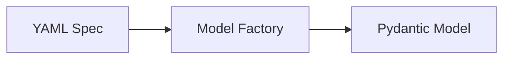

# Model Factory

The Model Factory dynamically generates Pydantic models from YAML schema specifications at runtime. This keeps the YAML specs as the single source of truth and avoids code duplication across profiles and versions.

## How It Works



1. **Load**: Read YAML specification file
2. **Parse**: Extract field definitions, types, and constraints
3. **Generate**: Create Pydantic model class with appropriate field types
4. **Register**: Store model in registry for later retrieval

## Usage

```python
from metaseed.models import get_model

Investigation = get_model("Investigation", version="1.1", profile="miappe")

inv = Investigation(
    unique_id="INV001",
    title="Drought tolerance study"
)
```

## Type Mapping

| Schema Type | Python Type |
|-------------|-------------|
| `string` | `str` |
| `integer` | `int` |
| `float` | `float` |
| `boolean` | `bool` |
| `date` | `datetime.date` |
| `datetime` | `datetime.datetime` |
| `uri` | `pydantic.HttpUrl` |
| `list` | `list[T]` |
| `entity` | nested model |

## Constraints

YAML spec constraints are mapped to Pydantic field constraints:

| YAML | Pydantic |
|------|----------|
| `pattern` | `pattern` |
| `min_length` | `min_length` |
| `max_length` | `max_length` |
| `minimum` | `ge` |
| `maximum` | `le` |
| `enum` | `Literal` type |

Cross-field validation (date ranges, conditional fields) is handled by separate validators.

## See Also

- [Schema Specs](../api/schema-specs.md) - Specification format
- [Profiles](../profiles/isa.md) - Available profiles
