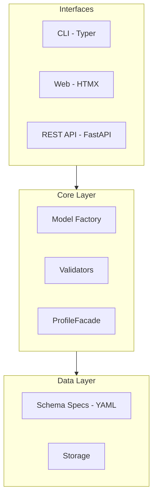

# Architecture Overview

Schema-driven architecture where YAML specs define metadata structure, and Pydantic models are generated at runtime.



## Components

| Component | Responsibility |
|-----------|----------------|
| **Schema Specs** | YAML files defining fields, types, and ontology references |
| **Model Factory** | Generates Pydantic models from specs at runtime |
| **Validators** | Cross-field validation, ontology checks, referential integrity |
| **ProfileFacade** | Fluent API for entity discovery and creation |
| **CLI** | Command-line interface (Typer) |
| **Web UI** | Visual editor (HTMX) |
| **REST API** | HTTP endpoints (FastAPI) |

## Design Principles

1. **Schema-first**: Metadata structure defined in YAML specs
2. **Ontology-backed**: References to PPEO, ISA, PROV-O ontologies
3. **Validation-focused**: Multiple validation layers
4. **Interface-agnostic**: Core logic separated from interfaces

## Entity Relationships

Entities are linked through **parent ID reference fields**. Each nested entity includes a reference to its parent, enabling:

- Round-trip Excel export/import
- Flat tabular representation
- Cross-entity validation

### MIAPPE Entity Hierarchy

```
Investigation
├── contacts → Person (investigation_id)
└── studies → Study (investigation_id)
    ├── persons → Person (study_id)
    ├── geographic_location → Location (study_id)
    ├── data_files → DataFile (study_id)
    ├── biological_materials → BiologicalMaterial (study_id)
    ├── observation_units → ObservationUnit (study_id)
    │   ├── samples → Sample (observation_unit_id)
    │   └── factor_values → FactorValue (observation_unit_id)
    ├── observed_variables → ObservedVariable (study_id)
    ├── factors → Factor (study_id)
    ├── events → Event (study_id)
    └── environments → Environment (study_id)
```

### Parent Reference Fields

| Entity | Parent Field | Parent Type |
|--------|--------------|-------------|
| Study | `investigation_id` | Investigation |
| Person | `investigation_id` or `study_id` | Investigation or Study |
| BiologicalMaterial | `study_id` | Study |
| ObservationUnit | `study_id` | Study |
| Sample | `observation_unit_id` | ObservationUnit |
| DataFile | `study_id` | Study |
| Factor | `study_id` | Study |
| FactorValue | `factor_id` | Factor |
| Event | `study_id` | Study |
| Environment | `study_id` | Study |
| Location | `study_id` | Study |

These references are required fields, ensuring every entity can be linked back to its parent for tabular export and validation.
