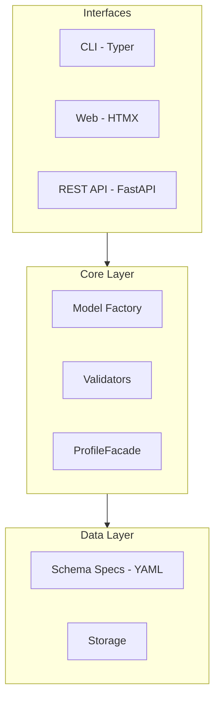

# Architecture Overview

Schema-driven architecture where YAML specs define metadata structure, and Pydantic models are generated at runtime.



## Components

| Component | Responsibility |
|-----------|----------------|
| **Schema Specs** | YAML files defining fields, types, and ontology references |
| **Model Factory** | Generates Pydantic models from specs at runtime |
| **Validators** | Cross-field validation, ontology checks, referential integrity |
| **ProfileFacade** | Fluent API for entity discovery and creation |
| **CLI** | Command-line interface (Typer) |
| **Web UI** | Visual editor (HTMX) |
| **REST API** | HTTP endpoints (FastAPI) |

## Available Profiles

| Profile | Versions | Description |
|---------|----------|-------------|
| [`isa`](isa.md) | 1.0 | Life science experiments (ISA framework) |
| [`miappe`](miappe.md) | 1.1 | Plant phenotyping (MIAPPE standard) |
| [`isa-miappe-combined`](combined.md) | 1.0, 2.0 | Unified ISA + MIAPPE model |

See [Comparison](comparison.md) for differences between ISA and MIAPPE.

```python
from metaseed import miappe, isa
from metaseed.facade import ProfileFacade

m = miappe()                                    # MIAPPE v1.1
i = isa()                                       # ISA v1.0
combined = ProfileFacade("isa-miappe-combined", "2.0")
```

## Design Principles

1. **Schema-first**: Metadata structure defined in YAML specs
2. **Ontology-backed**: References to PPEO, ISA, PROV-O ontologies
3. **Validation-focused**: Multiple validation layers
4. **Interface-agnostic**: Core logic separated from interfaces
