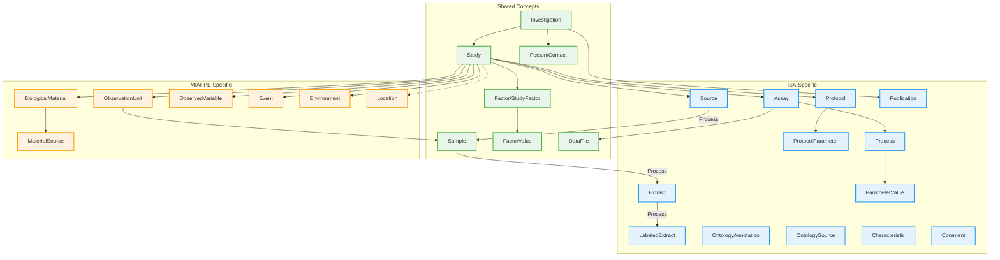

# ISA vs MIAPPE Comparison

ISA and MIAPPE were developed by different communities for different purposes, but they share common concepts. Both have Investigation and Study as top-level containers, both track experimental factors, and both produce data files. However, they model the experimental process differently.

**ISA** focuses on the transformations that occur during an experiment - how biological material is collected, processed, and measured. It uses a directed graph of Processes to capture provenance.

**MIAPPE** focuses on what is being observed and measured. It uses ObservationUnits as the central concept, with Events and Environment providing context for when and where measurements were taken.

When working with plant experiments that involve both phenotyping and molecular assays (e.g., measuring plant height and also doing RNA-seq), consider using the combined profile.

## Entity Comparison

## How They Model Experiments

**ISA** answers: "How was this data produced?"

An ISA experiment is a chain of transformations. You start with a Source (a patient, a plant), collect a Sample, extract molecules (Extract), label them for measurement (LabeledExtract), and run an assay that produces data. Each transformation is a Process that references a Protocol describing the method used.

**MIAPPE** answers: "What was measured and under what conditions?"

A MIAPPE experiment defines ObservationUnits (the things being measured - plants, plots) and ObservedVariables (the traits being measured - height, yield). Events record what happened (planting, watering) and Environment records conditions (temperature, humidity).

## Limitations

**ISA** lacks entities for environmental context (temperature, humidity) and temporal events (planting, harvest). Phenotypic trait definitions require workarounds through Characteristics or Comments. No Location entity exists for geographic context, and no ObservedVariable structure (trait/method/scale) for standardized measurement definitions. The format was designed for omics workflows, not field trials.

**MIAPPE** lacks process-level provenance. Molecular workflows (extraction, labeling, sequencing) cannot be captured. Protocol documentation is informal compared to ISA's structured ProtocolParameter system. The format is plant-specific by design (BiologicalMaterial assumes organism/genus/species). No OntologySource management reduces semantic rigor. No Assay concept exists to group measurements by technology.

**Both** formats cannot represent experiments that combine phenotyping and molecular assays within a single coherent model.

## References

| Standard | Specification | GitHub |
|----------|---------------|--------|
| ISA | <https://isa-specs.readthedocs.io/> | <https://github.com/ISA-tools/isa-api> |
| MIAPPE | <https://www.miappe.org/> | <https://github.com/MIAPPE/MIAPPE> |
