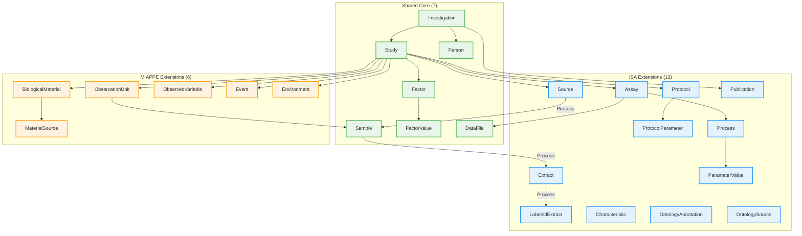
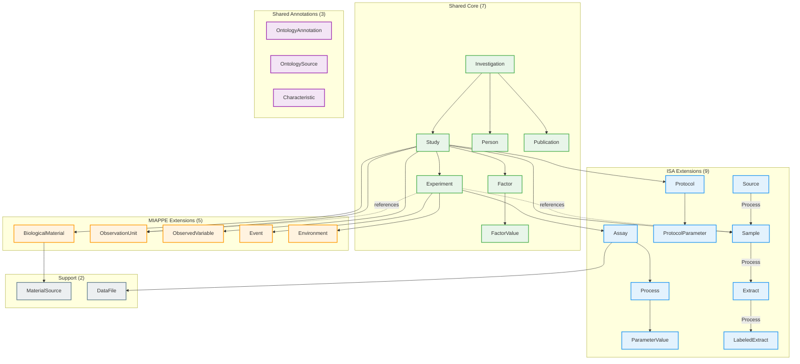
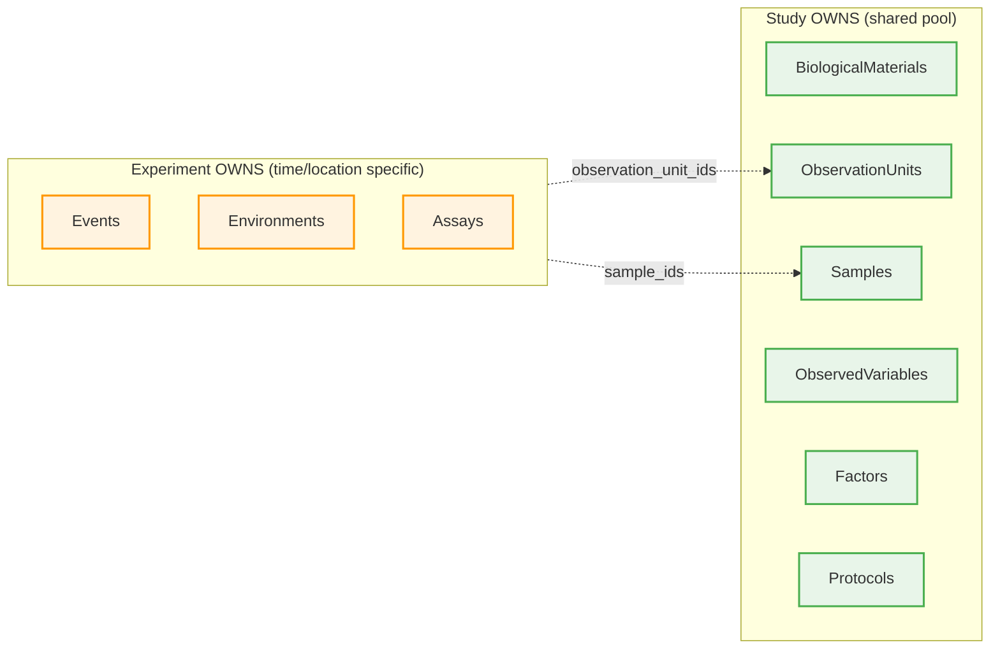

# ISA-MIAPPE-Combined

The combined profile merges ISA and MIAPPE into a single coherent model. This is useful for plant science experiments that involve both phenotyping (field measurements, growth observations) and molecular assays (genomics, transcriptomics, metabolomics).

Entities that exist in both standards (Investigation, Study, Person, Sample, Factor) are unified with a shared definition. ISA-specific entities (Assay, Protocol, Process) and MIAPPE-specific entities (BiologicalMaterial, ObservationUnit, ObservedVariable) are both available.

Two versions are available: v1.0 provides a straightforward merge, while v2.0 introduces an Experiment entity for multi-trial studies and uses a reference-based ownership model.

## v1.0

Version 1.0 contains 25 entities with a flat ownership model where Study directly owns most child entities.



---

## v2.0

Version 2.0 introduces the **Experiment** entity for studies that span multiple trials, locations, or time periods. A Study owns shared resources (biological materials, observation units, protocols) while Experiments reference these resources and own time/location-specific data (events, environments, assays).

This reference-based model avoids duplicating entity definitions across experiments while maintaining clear ownership.



### v2.0 Ownership Model



## v2.0 Changes from v1.0

| Change | Description |
|--------|-------------|
| **New Experiment entity** | For multi-trial studies within a Study |
| **Person** | Unified naming (`given_name`/`family_name`) |
| **Publication** | Promoted to shared core |
| **Reference model** | Experiment references Study's entities by ID |

## Usage

```python
from metaseed.facade import ProfileFacade

# v2.0 (recommended)
combined = ProfileFacade("isa-miappe-combined", "2.0")

# Both ISA and MIAPPE entities available
protocol = combined.Protocol(name="RNA Extraction")
material = combined.BiologicalMaterial(identifier="BM-001", organism="Zea mays")
experiment = combined.Experiment(identifier="EXP-001", observation_unit_ids=["OU-001"])

# v1.0
combined_v1 = ProfileFacade("isa-miappe-combined", "1.0")
```
