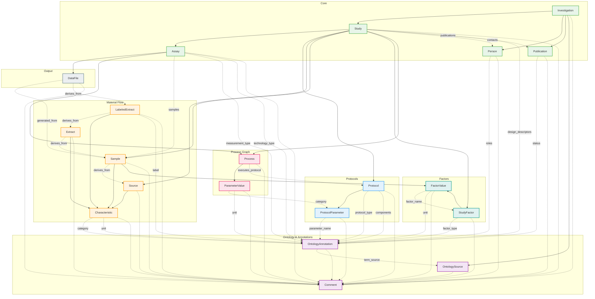
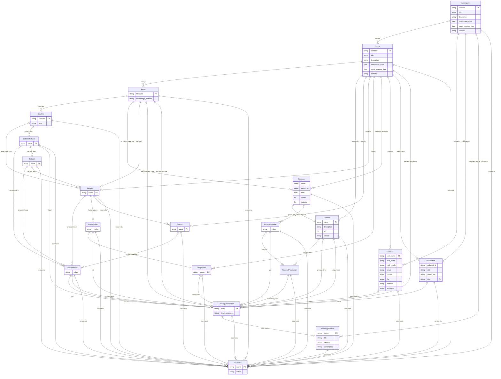

# ISA v1.0

The Investigation-Study-Assay (ISA) framework is a metadata standard for describing life science experiments. It was developed to enable consistent reporting of multi-omics experiments including genomics, transcriptomics, proteomics, and metabolomics.

ISA models experiments as a hierarchy: an **Investigation** contains one or more **Studies**, each of which contains one or more **Assays**. Material flows through the experiment via a directed acyclic graph of **Processes**, where biological samples are transformed from sources to extracts to labeled extracts, eventually producing data files.

The framework is widely adopted in bioinformatics and supported by tools like ISA-Tools and repositories like MetaboLights and ArrayExpress.



## Entities

| Category | Entities |
|----------|----------|
| **Core** | Investigation, Study, Assay, Person, Publication |
| **Protocols** | Protocol, ProtocolParameter |
| **Material Flow** | Source, Sample, Extract, LabeledExtract, Characteristic |
| **Process Graph** | Process, ParameterValue |
| **Factors** | StudyFactor, FactorValue |
| **Ontology** | OntologyAnnotation, OntologySource, Comment |
| **Output** | DataFile |

## Entity-Relationship Diagram

The following ERD shows all 121 fields across the 20 ISA entities: 53 scalar fields shown in entity boxes, 68 relationship fields shown as lines between entities. Fields marked with `PK` are primary keys.



## Key Concepts

**Process-centric workflow**: ISA models experiments as directed acyclic graphs where each node is a Process that transforms inputs into outputs. This captures the provenance of how data was generated from original biological material.

**Material flow chain**: Biological material follows a transformation path: Source (original organism/specimen) → Sample (collected material) → Extract (isolated component) → LabeledExtract (prepared for measurement) → DataFile (measurement results).

**Protocol-driven**: Every Process references a Protocol that describes how the transformation was performed, including parameters and their values. This ensures reproducibility.

**Ontology annotations**: Fields can be annotated with OntologyAnnotation to provide semantic meaning using controlled vocabularies from OntologySource references.

## Usage

```python
from metaseed import isa

i = isa()
source = i.Source(unique_id="SRC001", name="Patient 1")
sample = i.Sample(unique_id="SAM001", name="Blood sample", derives_from=[source])
```
