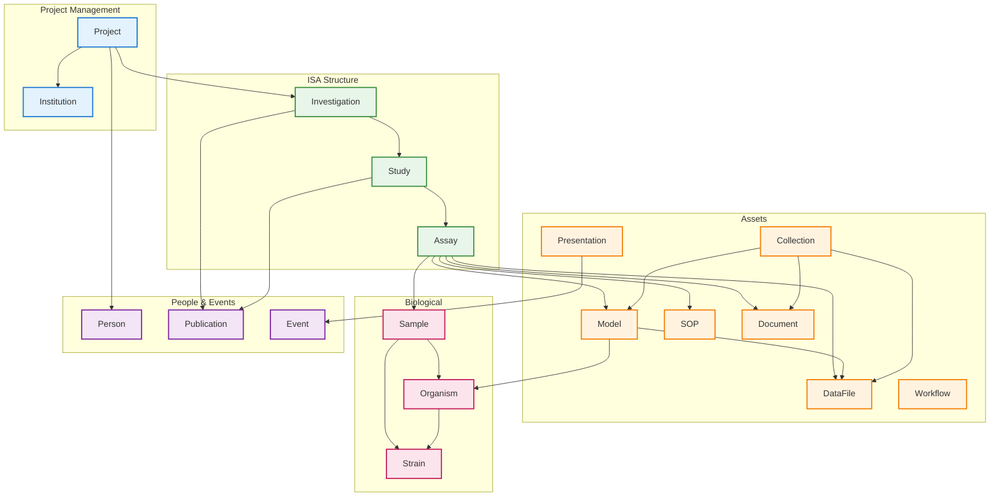

# JERM v1.0

The Just Enough Results Model (JERM) is a metadata framework used by FAIRDOM-SEEK for managing systems biology data. It extends the ISA (Investigation-Study-Assay) structure with additional asset types for computational models, workflows, and collaborative project management.

JERM is designed to capture the minimum metadata required to make experimental data discoverable and interpretable. It provides a bridge between laboratory data management and FAIR (Findable, Accessible, Interoperable, Reusable) data sharing.

## Overview

JERM organizes research data hierarchically:

- **Project**: Top-level organizational container for collaborative research
- **Investigation**: High-level research context and goals
- **Study**: Series of experiments addressing a biological question
- **Assay**: Individual experimental or computational analysis

Assets can be associated at various levels:

- **DataFile**: Experimental data in any format
- **Model**: Computational/mathematical models (SBML, CellML, etc.)
- **SOP**: Standard Operating Procedures
- **Document**: Reports, specifications, protocols
- **Presentation**: Slides, posters
- **Workflow**: Computational pipelines (Galaxy, CWL, Nextflow)

## Entity Diagram



## Entities

| Category | Entities |
|----------|----------|
| **Project** | Project, Institution |
| **ISA Core** | Investigation, Study, Assay |
| **Assets** | DataFile, Model, SOP, Document, Presentation, Workflow, Collection |
| **Biological** | Sample, SampleType, Organism, Strain |
| **People** | Person, Publication, Event |
| **Annotations** | OntologyAnnotation, Factor |

## Key Differences from ISA

| Aspect | ISA | JERM |
|--------|-----|------|
| Top-level | Investigation | Project |
| Models | Not included | First-class Model entity |
| Protocols | Protocol entity | SOP entity |
| Workflows | Not included | Workflow entity |
| Collections | Not included | Collection for grouping assets |
| Organisms | Via OntologyAnnotation | Dedicated Organism/Strain entities |
| Events | Not included | Event entity for conferences |

## Model Formats

JERM supports computational models in various formats:

| Format | Description |
|--------|-------------|
| SBML | Systems Biology Markup Language |
| CellML | Cell modeling language |
| BioPAX | Biological Pathway Exchange |
| MATLAB | MATLAB scripts and functions |
| Python | Python scripts |
| R | R scripts |

## Sample Types

JERM uses a flexible sample type system where:

- `SampleType` defines the template with attribute definitions
- `SampleAttributeDefinition` specifies required/optional attributes
- `Sample` instances conform to their type with `SampleAttribute` values

This allows custom sample types for different experimental domains.

## SEEK Integration

JERM is the underlying model for FAIRDOM-SEEK. Key integration points:

- **SEEK IDs**: Persistent URIs for all entities (`seek_id` field)
- **Versioning**: Assets track version numbers
- **Licensing**: Default and per-asset license information
- **Sharing policies**: Project-level default policies

## References

| Resource | URL |
|----------|-----|
| JERM Ontology | <https://jermontology.org/> |
| FAIRDOM-SEEK | <https://seek4science.org/> |
| FAIRDOMHub | <https://fairdomhub.org/> |
| SEEK API | <https://docs.seek4science.org/help/user-guide/api.html> |
| JERM GitHub | <https://github.com/FAIRdom/JERMOntology> |

## Usage

```python
from metaseed.specs.loader import SpecLoader

loader = SpecLoader()
jerm = loader.load_profile(version="1.0", profile="jerm")

# List all entities
print(jerm.list_entities())

# Get specific entity
project = jerm.get_entity("Project")
for field in project.fields:
    print(f"{field.name}: {field.type.value}")
```
