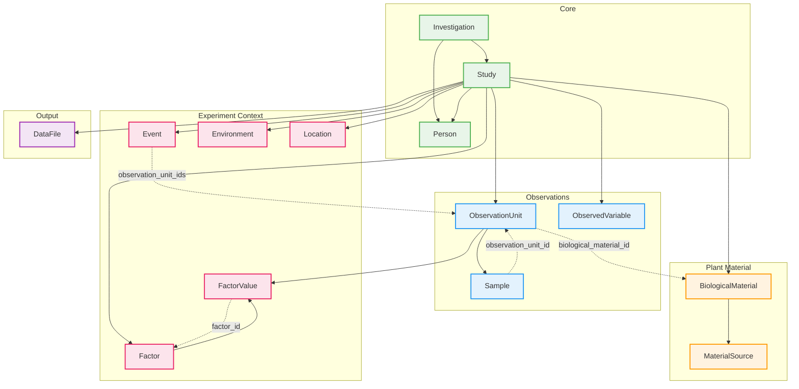
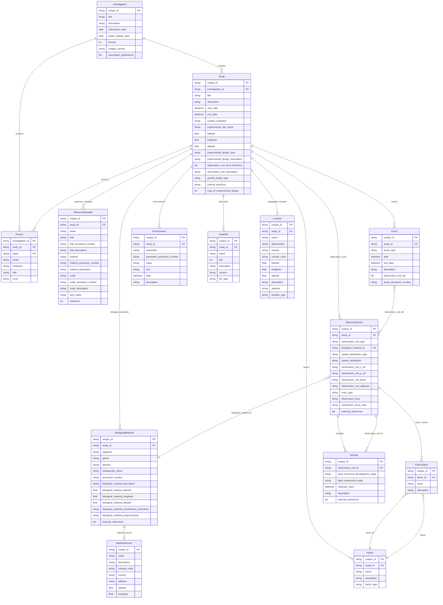

# MIAPPE v1.1

MIAPPE (Minimum Information About Plant Phenotyping Experiments) is a metadata standard for describing plant phenotyping studies. It was developed by the plant science community to enable consistent reporting of field trials, greenhouse experiments, and growth chamber studies.

MIAPPE focuses on **observation units** (individual plants, plots, or samples) and the **observed variables** (traits) measured on them. It captures the biological materials used, environmental conditions, and experimental factors that may affect plant phenotypes.

The standard is maintained by the MIAPPE consortium and is widely used in plant research databases and breeding information systems.



## Entities

| Category | Entities |
|----------|----------|
| **Core** | Investigation, Study, Person |
| **Plant Material** | BiologicalMaterial, MaterialSource |
| **Observations** | ObservationUnit, ObservedVariable, Sample |
| **Experiment Context** | Factor, FactorValue, Event, Environment, Location |
| **Output** | DataFile |

## Entity-Relationship Diagram

The following ERD shows all 138 fields across the 14 MIAPPE entities: 123 scalar fields shown in entity boxes, 15 relationship fields shown as lines between entities. Fields marked with `PK` are primary keys, `FK` indicates foreign keys.



## Key Concepts

**Observation-centric**: Unlike ISA's process workflows, MIAPPE centers on ObservationUnits - the things being measured. An observation unit can be a single plant, a pot, a plot, or any grouping of plants that receives the same treatment and is measured together.

**Biological material**: Plants are described through BiologicalMaterial entities that capture species, accession, and origin information. MaterialSource tracks where the genetic material came from (seed bank, collection site, etc.).

**Observed variables**: Measurements are defined by ObservedVariable entities using a trait/method/scale triplet. The trait describes what is measured (e.g., "plant height"), the method describes how (e.g., "ruler measurement"), and the scale describes the units and range (e.g., "centimeters, 0-300").

**Environmental context**: Event entities track things that happen during the experiment (planting, irrigation, harvest). Environment entities describe growth conditions (temperature, humidity, light).

## Entity Linking

Every nested entity includes a **parent reference field** that links it to its container. This enables:

- Round-trip Excel export/import without losing relationships
- Flat tabular representation for spreadsheet workflows
- Cross-entity validation and referential integrity

| Entity | Parent Field | Description |
|--------|--------------|-------------|
| Study | `investigation_id` | Links to parent Investigation |
| Person | `investigation_id` or `study_id` | Links to Investigation (as contact) or Study (as personnel) |
| BiologicalMaterial | `study_id` | Links to parent Study |
| ObservationUnit | `study_id` | Links to parent Study |
| ObservedVariable | `study_id` | Links to parent Study |
| Factor | `study_id` | Links to parent Study |
| FactorValue | `factor_id` | Links to parent Factor |
| Event | `study_id` | Links to parent Study |
| Environment | `study_id` | Links to parent Study |
| DataFile | `study_id` | Links to parent Study |
| Location | `study_id` | Links to parent Study |
| Sample | `observation_unit_id` | Links to parent ObservationUnit |

## Usage

```python
from metaseed import miappe

m = miappe()

# Create Investigation
inv = m.Investigation(unique_id="INV001", title="Drought study")

# Create Study linked to Investigation
study = m.Study(
    unique_id="STU001",
    investigation_id="INV001",
    title="Field trial 2024"
)

# Create BiologicalMaterial linked to Study
material = m.BiologicalMaterial(
    unique_id="BM001",
    study_id="STU001",
    organism="Zea mays"
)

# Create ObservationUnit linked to Study
obs_unit = m.ObservationUnit(
    unique_id="OU001",
    study_id="STU001",
    observation_unit_type="plant"
)
```
